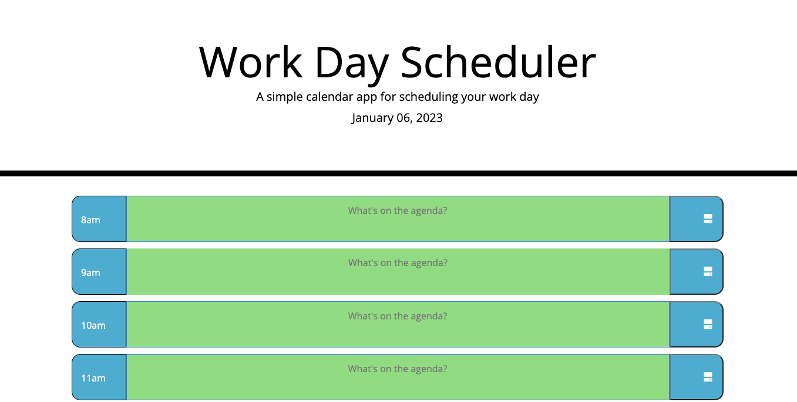

# Work Day Scheduler Starter Code

## Description
A website that offers a timed schedule to add tasks according to current hour. The color and text also changes according to time of day.

## How to use
Simply start typing your hourly tasks and the website will keep your information to use throughout the day.

## Technologies / Frameworks
* HTML
* CSS
* JQuery
* moment.js

## website
https://itzamary.github.io/Work-Day-Scheduler/

## website image

